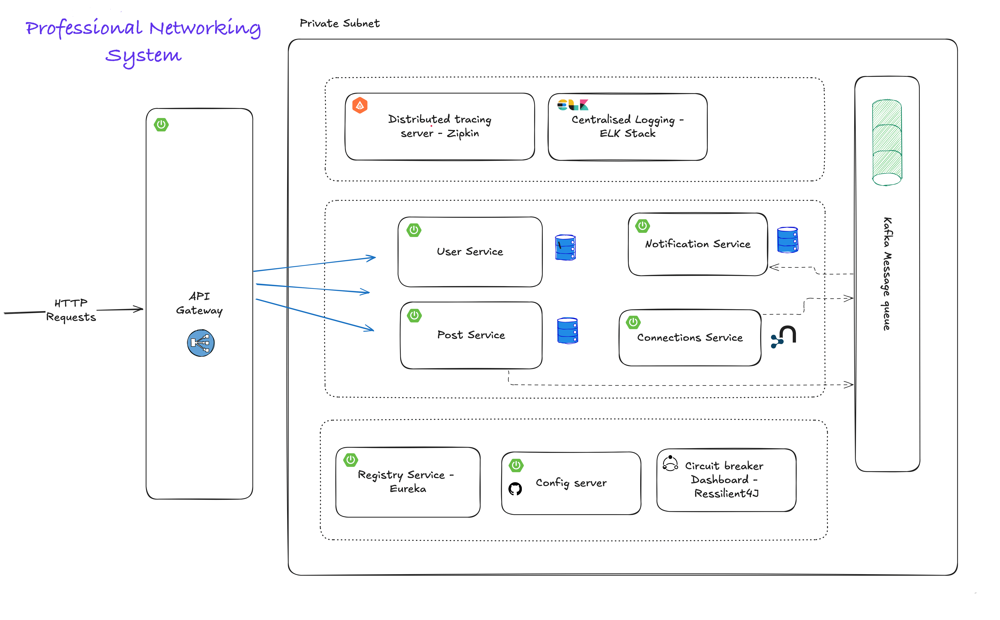

# Professional Networking System

[](https://github.com/abhaykumar255/Professional-Networking-System/actions)
[](https://hub.docker.com/u/abhaykumar255)
[](https://opensource.org/licenses/MIT)
[](https://openjdk.java.net/projects/jdk/17/)
[](https://spring.io/projects/spring-boot)

A comprehensive microservices-based professional networking platform built with Spring Boot, featuring real-time messaging, distributed tracing, and cloud-native deployment capabilities.

## 📋 Project Overview

This Professional Networking System is a LinkedIn-like platform designed using modern microservices architecture. The system enables professionals to connect, share content, and receive real-time notifications in a scalable, cloud-native environment.

### 🎯 Key Objectives
- **Scalability**: Handle thousands of concurrent users
- **Reliability**: 99.9% uptime with fault tolerance
- **Performance**: Sub-200ms response times
- **Observability**: Complete monitoring and tracing
- **Security**: JWT-based authentication and authorization

### 🏢 Business Features
- **Professional Profiles**: Complete user profile management
- **Networking**: Send/accept connection requests
- **Content Sharing**: Create and interact with posts
- **Real-time Notifications**: Instant updates for activities
- **Search & Discovery**: Find professionals and content

## 📸 Screenshots

### System Architecture


### Live Demo
🔗 [Live Demo](http://34.107.215.249) | 📖 [API Documentation](http://34.107.215.249:9020/users/swagger-ui.html)

## 🏗️ Architecture Overview

This system follows a microservices architecture pattern with clear separation of concerns and technology-specific optimizations.

### 🔧 Core Microservices

| Service | Port | Technology Stack | Purpose | Database |
|---------|------|------------------|---------|----------|
| **API Gateway** | 9000 | Spring Cloud Gateway, Redis | Request routing, authentication, rate limiting | Redis (sessions) |
| **User Service** | 9020 | Spring Boot, Spring Security, JWT | User management, authentication, profiles | PostgreSQL |
| **Posts Service** | 9010 | Spring Boot, Spring Data JPA | Content creation, management, interactions | PostgreSQL |
| **Connection Service** | 9030 | Spring Boot, Spring Data Neo4j | Professional relationships, network graph | Neo4j |
| **Notification Service** | 9040 | Spring Boot, Kafka Consumers | Real-time notifications, messaging | PostgreSQL |

### 🛠️ Infrastructure Components

| Component | Technology | Purpose | Configuration |
|-----------|------------|---------|---------------|
| **Service Discovery** | Netflix Eureka | Service registration and discovery | Port 8761 |
| **Message Broker** | Apache Kafka | Asynchronous communication, event streaming | KRaft mode |
| **Distributed Tracing** | Zipkin | Request tracing across microservices | Port 9411 |
| **Caching Layer** | Redis | Session management, performance optimization | Port 6379 |
| **Centralized Logging** | ELK Stack | Log aggregation and analysis | Elasticsearch, Logstash, Kibana |
| **Container Orchestration** | Kubernetes/Docker | Deployment and scaling | GKE cluster |

### 🗄️ Database Architecture

#### PostgreSQL Databases
- **Users DB**: User profiles, authentication data, preferences
- **Posts DB**: Content, comments, likes, media attachments
- **Notifications DB**: Notification history, user preferences

#### Neo4j Graph Database
- **Connections DB**: Professional relationships, network analysis
- **Graph Queries**: Friend suggestions, network insights, shortest paths

#### Redis Cache
- **Session Store**: JWT tokens, user sessions
- **Performance Cache**: Frequently accessed data, API responses

## 🚀 Technology Stack Deep Dive

### Backend Technologies

#### Core Framework
- **Java 17**: Latest LTS version with performance improvements
- **Spring Boot 3.5.5**: Microservices framework with auto-configuration
- **Spring Cloud Gateway**: API gateway with reactive programming
- **Spring Security**: Authentication and authorization
- **Spring Data JPA**: Relational database operations
- **Spring Data Neo4j**: Graph database operations

#### Communication & Messaging
- **Apache Kafka**: Event-driven architecture, real-time messaging
- **REST APIs**: Synchronous service communication
- **WebSocket**: Real-time notifications (planned)

#### Data Persistence
- **PostgreSQL**: ACID compliance for critical business data
- **Neo4j**: Graph relationships for social networking features
- **Redis**: In-memory caching and session management

#### Observability & Monitoring
- **Zipkin**: Distributed tracing with 100% sampling
- **ELK Stack**: Centralized logging and analysis
- **Spring Actuator**: Health checks and metrics
- **Filebeat**: Log shipping and forwarding

#### DevOps & Deployment
- **Docker**: Containerization for all services
- **Kubernetes**: Container orchestration and scaling
- **Google Kubernetes Engine**: Managed Kubernetes service
- **GitHub Actions**: CI/CD pipeline automation

## 🚀 Features

### User Management
- **Registration & Authentication**: JWT-based secure authentication
- **Profile Management**: Complete professional profiles
- **Role-based Access**: Different user permissions
- **Password Security**: Encrypted password storage

### Professional Networking
- **Connection Requests**: Send and manage connection requests
- **Network Visualization**: Graph-based relationship mapping
- **Friend Suggestions**: AI-powered connection recommendations
- **Network Analytics**: Connection insights and statistics

### Content Management
- **Post Creation**: Rich text posts with media support
- **Content Interaction**: Like, comment, share functionality
- **Feed Algorithm**: Personalized content delivery
- **Content Moderation**: Automated content filtering

### Real-time Features
- **Live Notifications**: Instant updates for user activities
- **Event Streaming**: Kafka-based real-time data flow
- **WebSocket Support**: Real-time messaging capabilities
- **Push Notifications**: Mobile and web notifications

### System Features
- **Auto-scaling**: Kubernetes HPA for dynamic scaling
- **Load Balancing**: Distributed request handling
- **Circuit Breaker**: Fault tolerance and resilience
- **Health Monitoring**: Comprehensive system health checks

## 📊 Performance Metrics

- **Response Time**: < 200ms average across all services
- **Throughput**: 1000+ requests/second sustained load
- **Uptime**: 99.9% availability with redundancy
- **Scalability**: Auto-scaling based on CPU/memory usage
- **Database Performance**: Optimized queries with connection pooling

## 🛠️ Service-Specific Technologies

### API Gateway
- **Spring Cloud Gateway**: Reactive gateway with WebFlux
- **Redis Integration**: Session management and rate limiting
- **JWT Validation**: Centralized authentication
- **Request Routing**: Dynamic service discovery

### User Service
- **Spring Security**: Authentication and authorization
- **BCrypt**: Password hashing and security
- **JWT Tokens**: Stateless authentication
- **PostgreSQL**: User data persistence

### Posts Service
- **Spring Data JPA**: ORM for content management
- **Hibernate**: Advanced ORM features
- **Connection Pooling**: HikariCP for performance
- **Caching**: Redis for frequently accessed content

### Connection Service
- **Neo4j**: Graph database for relationships
- **Cypher Queries**: Graph traversal and analysis
- **Spring Data Neo4j**: Object-graph mapping
- **Network Algorithms**: Shortest path, recommendations

### Notification Service
- **Kafka Consumers**: Event-driven notifications
- **Async Processing**: Non-blocking notification delivery
- **Template Engine**: Dynamic notification content
- **Delivery Tracking**: Notification status management

## 📋 Prerequisites

- **Java 17+**: OpenJDK or Oracle JDK
- **Docker & Docker Compose**: Container runtime
- **Maven 3.8+**: Build automation
- **kubectl**: Kubernetes CLI (for K8s deployment)
- **Git**: Version control

## 🚀 Quick Start

### Local Development with Docker Compose

1. **Clone the repository**
```bash
git clone https://github.com/abhaykumar255/Professional-Networking-System.git
cd Professional-Networking-System
```

2. **Start all services**
```bash
docker-compose up -d
```

3. **Verify services are running**
```bash
docker-compose ps
```

4. **Access the application**
- **API Gateway**: http://localhost:9000
- **User Service Health**: http://localhost:9020/users/actuator/health
- **Kibana Dashboard**: http://localhost:5601
- **Kafka UI**: http://localhost:8080
- **Neo4j Browser**: http://localhost:7474

### Kubernetes Deployment

1. **Deploy to Kubernetes**
```bash
cd k8s
chmod +x deploy-all.sh
./deploy-all.sh
```

2. **Monitor deployment**
```bash
kubectl get pods -w
kubectl get services
```

3. **Access external services**
```bash
kubectl get services --field-selector spec.type=LoadBalancer
```

## 📚 API Documentation

### Interactive API Explorer
- **User Service Swagger**: http://localhost:9020/users/swagger-ui.html
- **Posts Service Swagger**: http://localhost:9010/posts/swagger-ui.html
- **Connection Service Swagger**: http://localhost:9030/connections/swagger-ui.html
- **Notification Service Swagger**: http://localhost:9040/notifications/swagger-ui.html
- **OpenAPI Specification**: Available in `open-api/openapi.yaml`

### API Gateway Routes
- **Gateway Health**: http://localhost:9000/actuator/health
- **All requests route through**: http://localhost:9000/api/v1/*

### Key API Endpoints

#### Authentication
```bash
POST /api/v1/auth/register    # User registration
POST /api/v1/auth/login       # User login
POST /api/v1/auth/refresh     # Token refresh
```

#### User Management
```bash
GET    /api/v1/users/profile     # Get user profile
PUT    /api/v1/users/profile     # Update profile
GET    /api/v1/users/search      # Search users
DELETE /api/v1/users/account     # Delete account
```

#### Posts & Content
```bash
GET    /api/v1/posts             # Get feed
POST   /api/v1/posts             # Create post
PUT    /api/v1/posts/{id}        # Update post
DELETE /api/v1/posts/{id}        # Delete post
POST   /api/v1/posts/{id}/like   # Like post
```

#### Connections
```bash
GET    /api/v1/connections                # Get connections
POST   /api/v1/connections/request        # Send request
PUT    /api/v1/connections/accept/{id}    # Accept request
DELETE /api/v1/connections/{id}           # Remove connection
```

#### Notifications
```bash
GET    /api/v1/notifications              # Get notifications
PUT    /api/v1/notifications/{id}/read    # Mark as read
DELETE /api/v1/notifications/{id}         # Delete notification
```

## 🔧 Service Configuration

### Environment Variables

#### Database Configuration
```bash
# PostgreSQL
DB_SERVICE=<database-host>
DB_NAME=<database-name>
DB_USER=<username>
DB_PASSWORD=<password>

# Neo4j
NEO4J_URI=neo4j://connections-db:7687
NEO4J_USERNAME=neo4j
NEO4J_PASSWORD=password

# Redis
REDIS_HOST=redis
REDIS_PORT=6379
```

#### Service Discovery
```bash
EUREKA_SERVER=http://discovery-server:8761/eureka
```

#### Monitoring
```bash
ZIPKIN_URL=http://zipkin:9411/api/v2/spans
ELASTICSEARCH_URL=http://elasticsearch:9200
```

### Service Profiles
- **default**: Local development with Docker Compose
- **k8s**: Kubernetes deployment
- **prod**: Production environment

## 📊 Monitoring & Observability

### Distributed Tracing
- **Zipkin Dashboard**: http://localhost:9411
- **Trace Sampling**: 100% for development, 10% for production
- **Service Dependencies**: Visual service map
- **Performance Analysis**: Request latency and bottlenecks

### Centralized Logging
- **Kibana Dashboard**: http://localhost:5601
- **Log Aggregation**: All services → Filebeat → Logstash → Elasticsearch
- **Log Levels**: DEBUG, INFO, WARN, ERROR
- **Structured Logging**: JSON format with trace correlation

### Health Monitoring
```bash
# Service Health Checks
GET /users/actuator/health
GET /posts/actuator/health
GET /connections/actuator/health
GET /notifications/actuator/health

# Detailed Health Info
GET /{service}/actuator/health/db
GET /{service}/actuator/health/redis
```

### Metrics & Analytics
- **Application Metrics**: Request count, response time, error rate
- **Infrastructure Metrics**: CPU, memory, disk usage
- **Business Metrics**: User registrations, posts created, connections made

## 🔄 CI/CD Pipeline

### GitHub Actions Workflow

The automated pipeline includes:

#### Build Stage
1. **Code Checkout**: Latest source code
2. **Java Setup**: OpenJDK 17 installation
3. **Maven Build**: Clean compile and package
4. **Docker Build**: Multi-service container creation
5. **Registry Push**: Docker Hub image publishing

#### Deploy Stage
1. **GKE Authentication**: Service account setup
2. **Kubernetes Deployment**: Rolling updates
3. **Health Verification**: Service readiness checks
4. **Rollback Capability**: Automatic failure recovery

### Deployment Triggers
- **Automatic**: Push to `develop` branch
- **Manual**: GitHub Actions workflow dispatch
- **Scheduled**: Nightly builds and deployments

## 🗄️ Database Design

### PostgreSQL Schema

#### Users Database
```sql
-- User profiles and authentication
CREATE TABLE users (
    id BIGSERIAL PRIMARY KEY,
    username VARCHAR(50) UNIQUE NOT NULL,
    email VARCHAR(100) UNIQUE NOT NULL,
    password_hash VARCHAR(255) NOT NULL,
    first_name VARCHAR(50),
    last_name VARCHAR(50),
    created_at TIMESTAMP DEFAULT CURRENT_TIMESTAMP
);
```

#### Posts Database
```sql
-- Content and interactions
CREATE TABLE posts (
    id BIGSERIAL PRIMARY KEY,
    user_id BIGINT REFERENCES users(id),
    content TEXT NOT NULL,
    created_at TIMESTAMP DEFAULT CURRENT_TIMESTAMP,
    updated_at TIMESTAMP DEFAULT CURRENT_TIMESTAMP
);

CREATE TABLE post_likes (
    post_id BIGINT REFERENCES posts(id),
    user_id BIGINT REFERENCES users(id),
    created_at TIMESTAMP DEFAULT CURRENT_TIMESTAMP,
    PRIMARY KEY (post_id, user_id)
);
```

### Neo4j Graph Schema

#### Connection Relationships
```cypher
// User nodes
CREATE (u:User {
    id: 'user123',
    username: 'john_doe',
    name: 'John Doe'
})

// Connection relationships
MATCH (a:User {id: 'user1'}), (b:User {id: 'user2'})
CREATE (a)-[r:CONNECTED_TO {
    since: date(),
    status: 'ACCEPTED'
}]->(b)

// Network analysis queries
MATCH (a:User)-[:CONNECTED_TO]->(b:User)-[:CONNECTED_TO]->(c:User)
WHERE a.id = 'user123' AND c.id <> 'user123'
RETURN c.name AS suggestion
```

## 🔐 Security Implementation

### Authentication & Authorization
- **JWT Tokens**: Stateless authentication with RS256 signing
- **Token Expiration**: 24-hour access tokens, 7-day refresh tokens
- **Role-based Access**: USER, ADMIN, MODERATOR roles
- **API Rate Limiting**: Redis-based request throttling

### Data Security
- **Password Hashing**: BCrypt with salt rounds
- **SQL Injection Prevention**: Parameterized queries
- **XSS Protection**: Input sanitization and validation
- **CORS Configuration**: Restricted cross-origin requests

### Network Security
- **HTTPS Enforcement**: TLS 1.3 for all communications
- **Service Mesh**: Internal service communication encryption
- **Firewall Rules**: Kubernetes network policies
- **Secret Management**: Kubernetes secrets for sensitive data

## 📈 Performance Optimization

### Caching Strategy
- **Redis Cache**: User sessions, frequently accessed data
- **Application Cache**: Spring Cache with Redis backend
- **Database Cache**: Query result caching
- **CDN Integration**: Static asset delivery (planned)

### Database Optimization
- **Connection Pooling**: HikariCP with optimized settings
- **Query Optimization**: Indexed columns and efficient queries
- **Read Replicas**: Separate read/write database instances
- **Partitioning**: Large table partitioning strategies

### Microservices Optimization
- **Async Processing**: Kafka for non-blocking operations
- **Circuit Breaker**: Hystrix for fault tolerance
- **Load Balancing**: Kubernetes service load balancing
- **Auto-scaling**: HPA based on CPU and memory metrics

## 🐳 Docker Configuration

### Multi-stage Builds
All services use optimized Dockerfiles with:
- **Maven Dependency Caching**: Faster builds
- **Layered JARs**: Efficient image updates
- **Security Scanning**: Vulnerability detection
- **Size Optimization**: Minimal base images

### Available Images
```bash
# Pull latest images
docker pull abhaykumar255/professional-system_api-gateway:latest
docker pull abhaykumar255/professional-system_user-service:latest
docker pull abhaykumar255/professional-system_posts-service:latest
docker pull abhaykumar255/professional-system_connection-service:latest
docker pull abhaykumar255/professional-system_notification-service:latest
```

## 🔧 Troubleshooting Guide

### Common Issues

#### Service Startup Problems
```bash
# Check service logs
docker-compose logs <service-name>
kubectl logs -f deployment/<service-name>

# Verify dependencies
docker-compose ps
kubectl get pods
```

#### Database Connection Issues
```bash
# Test database connectivity
docker exec -it users-db psql -U postgres -d usersDB
docker exec -it connections-db cypher-shell -u neo4j -p password

# Check database status
kubectl get pods | grep db
```

#### Network and Port Issues
```bash
# Check port availability
netstat -tulpn | grep :9000
lsof -i :9000

# Verify service discovery
curl http://localhost:8761/eureka/apps
```

#### Performance Issues
```bash
# Monitor resource usage
docker stats
kubectl top pods

# Check application metrics
curl http://localhost:9020/users/actuator/metrics
```

### Debug Mode
Enable debug logging by setting:
```bash
LOGGING_LEVEL_COM_PROFESSIONALNETWORKING=DEBUG
```

## 🤝 Contributing

We welcome contributions! Please follow these guidelines:

### Development Setup
1. Fork the repository
2. Create a feature branch: `git checkout -b feature/amazing-feature`
3. Make your changes
4. Add tests for new functionality
5. Ensure all tests pass: `mvn test`
6. Commit your changes: `git commit -m 'Add amazing feature'`
7. Push to the branch: `git push origin feature/amazing-feature`
8. Open a Pull Request

### Code Standards
- **Java**: Follow Google Java Style Guide
- **Documentation**: Update README and API docs
- **Testing**: Maintain 80%+ code coverage
- **Security**: Follow OWASP guidelines

### Pull Request Process
1. Update documentation
2. Add/update tests
3. Ensure CI/CD pipeline passes
4. Request code review
5. Address feedback
6. Merge after approval

## 📄 License

This project is licensed under the MIT License - see the [LICENSE](LICENSE) file for details.

## 📞 Support & Community

### Getting Help
- **GitHub Issues**: Bug reports and feature requests
- **Discussions**: Community Q&A and ideas
- **Documentation**: Comprehensive guides and tutorials
- **Stack Overflow**: Tag questions with `professional-networking-system`

### Maintainers
- **Lead Developer**: [@abhaykumar255](https://github.com/abhaykumar255)
- **Contributors**: See [CONTRIBUTORS.md](CONTRIBUTORS.md)

## 🙏 Acknowledgments

### Technology Partners
- **Spring Team**: Excellent microservices framework
- **Neo4j**: Powerful graph database capabilities
- **Apache Kafka**: Reliable event streaming platform
- **Elastic**: Comprehensive observability stack
- **Docker**: Containerization technology
- **Kubernetes**: Container orchestration platform

### Open Source Community
- **Contributors**: All community contributors
- **Testers**: Beta testers and feedback providers
- **Documentation**: Technical writers and reviewers

---

## 🌟 Star History

⭐ **Star this repository if you find it helpful!**

[](https://star-history.com/#abhaykumar255/Professional-Networking-System&Date)

---

**Built with ❤️ by Me **